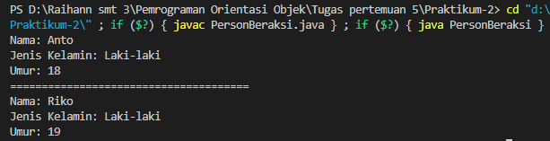

# Tugas Pertemuan 5
## Pemrograman Orientasi Objek

```sh
Nama   : Raihan Tantowi
Nim    : 312110229
Matkul : Pemrograman Orientasi Objek
```

### 1. File Person.java
* **CODINGAN FILE 1 (Person.java):**
```java
public class Person {
    private String nama;
    private String jeniskelamin;
    private int umur;
    // setter
    public void setNama(String nama) {
    this.nama = nama;
    }
    public void setJenisKelamin(String jeniskelamin) {
    this.jeniskelamin = jeniskelamin;
    }
    public void setUmur(int umur) {
    this.umur = umur;
    }
    // getter
    public String getNama() {
    return this.nama;
    }
    public String getJenisKelamin() {
    return this.jeniskelamin;
    }
    public int getUmur() {
    return this.umur;
    }
    }
```


### 2. File PersonBeraksi.java
* **CODINGAN FILE 2 (PersonBeraksi.java):**
```java
public class PersonBeraksi{
    public static void main(String[] args){
    // Membuat object
    Person Anto = new Person();
    Person Riko = new Person();
    /* memanggil atribut dan memberi nilai */
    Anto.setNama("Anto");
    Anto.setJenisKelamin("Laki-laki");
    Anto.setUmur(18);

    Riko.setNama("Riko");
    Riko.setJenisKelamin("Laki-laki");
    Riko.setUmur(19);
    System.out.println("Nama: " + Anto.getNama());
    System.out.println("Jenis Kelamin: " + Anto.getJenisKelamin());
    System.out.println("Umur: " + Anto.getUmur());
    System.out.println("======================================");
    System.out.println("Nama: " + Riko.getNama());
    System.out.println("Jenis Kelamin: " + Riko.getJenisKelamin());
    System.out.println("Umur: " + Riko.getUmur());
    }
    }
```

* **Hasil output program:**


